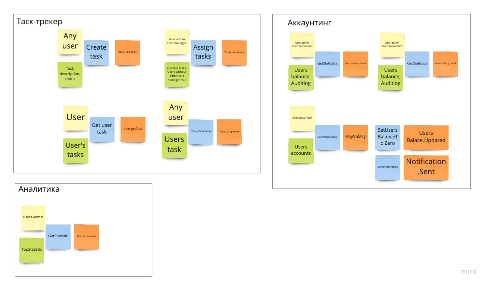
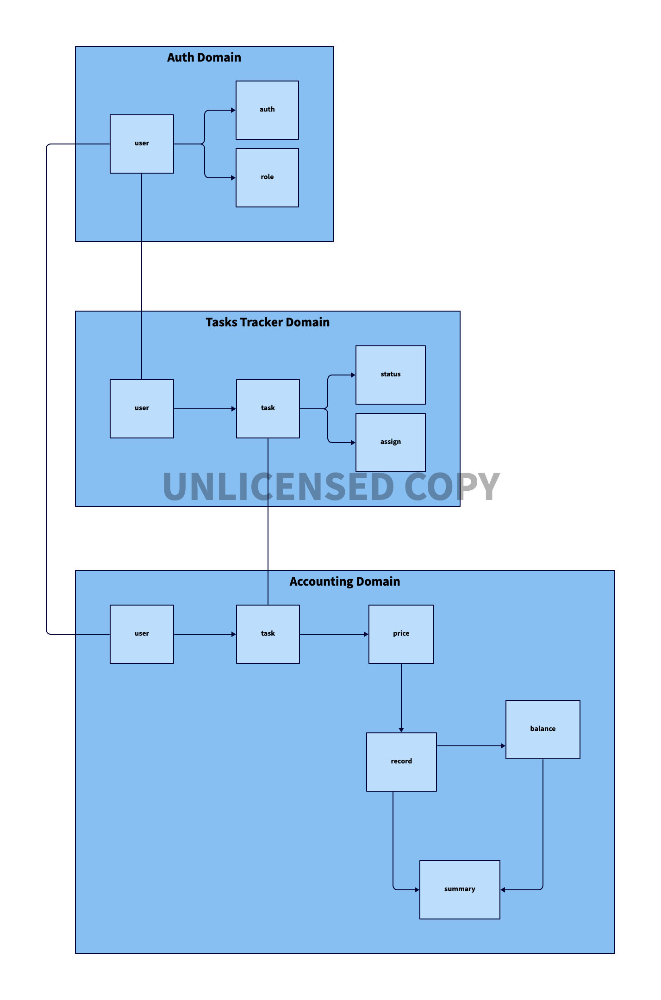

# Infra

## How to use 

https://d2lang.com/tour/install

install: `curl -fsSL https://d2lang.com/install.sh | sh -s --`

run: `d2 --layout tala --theme 4 -w infra.d2 infra.png`

## EventStoring

## Domains

## Events

### Buisiness events

Назначение задачи/выполнение задачи taskTracker->Accounting
Выплата зп taskTracker->Accounting user.id
Изменен пользователь auth -> все сервисы 

### CUD events

User.changed auth->(taskTracker,Accounting, Analitics)

Task.changed taskTracker->(Accounting, Analitics) - id, user.id, status

Balance.changed Accounting->Analitics - user.id, balance

